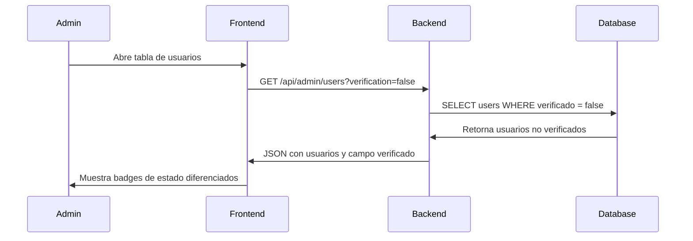

#  Estado de Verificación en Tabla de Admin - Implementación Completa

## - [x] **Funcionalidad Implementada**

###  **Nueva Columna de Estado**

La tabla de usuarios en el panel de administración ahora muestra **dos estados claramente diferenciados**:


1. **Estado de Actividad**:

- [x] **Activo** (verde) - Usuario habilitado en el sistema

   - ❌ **Inactivo** (rojo) - Usuario deshabilitado


2. **Estado de Verificación**:

- [x] **Verificado** (azul) - Email confirmado

   -  **No verificado** (amarillo) - Email pendiente de confirmación

### 🔍 **Filtros Avanzados**

Se agregaron nuevos filtros para mejorar la gestión:


- **Filtro por Rol**: Admin, Profesor, Estudiante, Todos

- **Filtro por Verificación**:

  - Todos los estados

  - Solo verificados

  - Solo no verificados

###  **Interfaz Mejorada**

```tsx
// Antes: Solo mostraba activo/inactivo
<span className="badge">Activo</span>

// Ahora: Muestra ambos estados
<div className="flex flex-col gap-1">
  <span className="badge-green">Activo</span>
  <span className="badge-yellow">No verificado</span>
</div>
```

text
## 🛠️ **Archivos Modificados**

### 1. **Frontend** - `AdminUserCrud.tsx`


- [x] Interfaz `User` actualizada con campo `verificado`

- [x] Nuevo estado `verificationFilter`

- [x] Filtro de verificación en UI

- [x] Columna de estado mejorada con doble badge

- [x] Función `fetchUsers` actualizada con nuevo parámetro

### 2. **Backend** - `/api/admin/users/route.ts`


- [x] Tipo `UserWhere` extendido con `verificado`

- [x] Parámetro `verification` en query string

- [x] Filtro por estado de verificación en consulta

- [x] Campo `verificado` incluido en respuesta JSON

##  **Colores y Diseño**

| Estado | Color | Clase CSS | Significado |
|--------|-------|-----------|-------------|
| Activo | Verde | `bg-green-100 text-green-800` | Usuario habilitado |
| Inactivo | Rojo | `bg-red-100 text-red-800` | Usuario deshabilitado |
| Verificado | Azul | `bg-blue-100 text-blue-800` | Email confirmado |
| No verificado | Amarillo | `bg-yellow-100 text-yellow-800` | Email pendiente |

## 📋 **Casos de Uso**

### **Administrador puede ahora:**


1. **Identificar usuarios no verificados** de un vistazo

2. **Filtrar por estado de verificación** para gestión masiva

3. **Combinar filtros** (ej: "Estudiantes no verificados")

4. **Tomar acciones** basadas en el estado de verificación

### **Ejemplos prácticos:**

```bash
# Ver solo usuarios no verificados

Filtro: "No verificados"

# Ver estudiantes que no han verificado su email

Rol: "Estudiantes" + Verificación: "No verificados"

# Ver todos los usuarios activos y verificados

Estado: "Activos" (visual) + Filtro: "Verificados"
```

text
##  **Flujo Completo**



text
##  **Beneficios**


- [x] **Visibilidad mejorada** del estado de usuarios

- [x] **Gestión eficiente** de verificaciones pendientes

- [x] **Filtrado avanzado** para acciones masivas

- [x] **UX consistente** con el resto del sistema

- [x] **Información clara** sin sobrecargar la interfaz

**Resultado:** Los administradores ahora pueden identificar y gestionar fácilmente usuarios que no han verificado su correo electrónico, mejorando la seguridad y el control del sistema.
